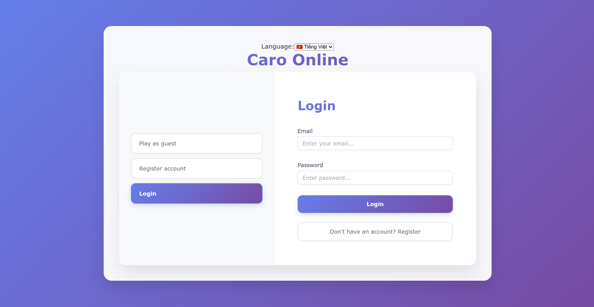
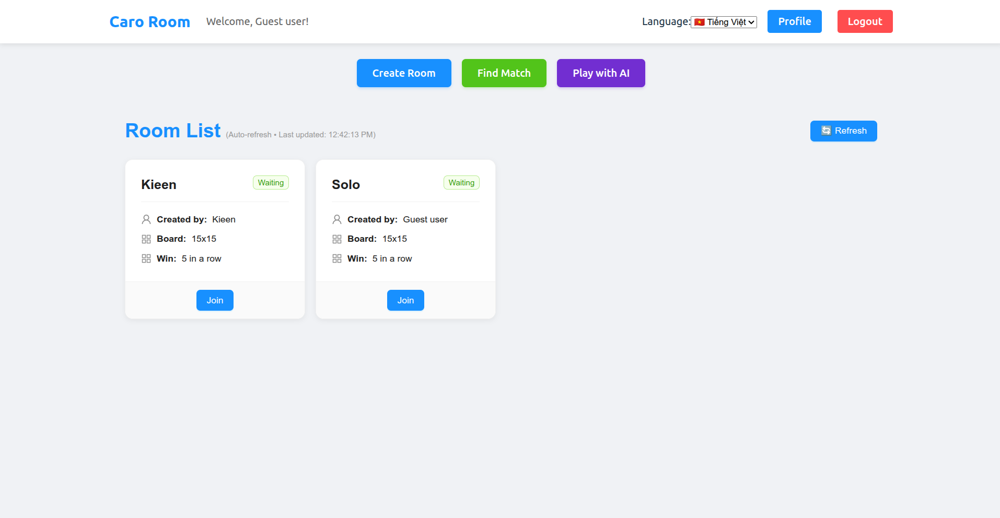
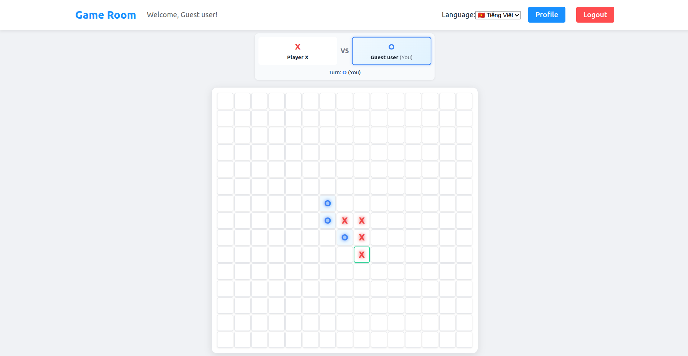
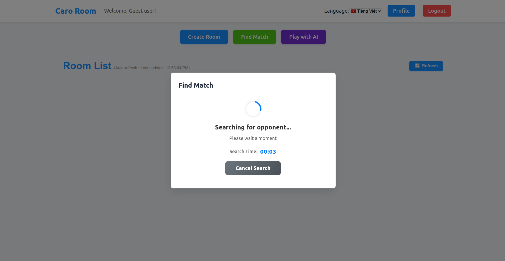

# Caro Online Client

A modern, responsive web client for the Caro Online multiplayer game platform built with React, TypeScript, and real-time WebSocket communication.

## Description

Caro Online Client is a sophisticated frontend application that provides an immersive multiplayer Caro (Gomoku) gaming experience. The client features real-time gameplay, intelligent matchmaking, AI opponents, comprehensive room management, and multilingual support. Built with modern React patterns and optimized for performance, it delivers seamless gaming experiences across different devices and screen sizes.

## Screenshots

### 🏠 **Homepage & Authentication**

*Landing page with authentication options (Guest, Register, Login)*

### 🏠 **Room Management**

*Browse and join available game rooms*

### 🎮 **Game Interface**

*Real-time multiplayer game with interactive board*

### 🔍 **Matchmaking**

*Intelligent player matching with ELO-based system*


## Related Projects

- **Backend**: [Caro Online Server](https://github.com/maivankien/caro-online-server) - NestJS-based backend API

## Features

### 🎮 **Core Game Features**
- **Real-time Multiplayer**: WebSocket-based instant move synchronization and game state updates
- **Interactive Game Board**: Responsive Caro board with customizable sizes (5x5 to 20x20)
- **AI Opponent Integration**: Seamless single-player vs AI gameplay with advanced AI algorithms
- **Game State Management**: Real-time board updates, turn indicators, and win condition detection
- **Rematch System**: Built-in rematch functionality for continuous gameplay sessions

### 🏠 **Room Management**
- **Custom Room Creation**: User-created rooms with password protection and customizable settings
- **Room Discovery**: Browse and join available rooms with real-time updates
- **Room Lobby**: Pre-game waiting area with player information and game settings
- **Room Status Tracking**: Live room status updates (waiting, playing, finished)

### 🔍 **Matchmaking System**
- **Intelligent Matching**: ELO-based player matching for fair and competitive games
- **Queue Management**: Real-time matchmaking with progress indicators
- **Auto-join**: Seamless transition from matchmaking to game room
- **Timeout Handling**: Graceful handling of matchmaking timeouts and failures

### 🔐 **Authentication & User Management**
- **Multiple Auth Methods**: Guest access, user registration, and login
- **JWT Integration**: Secure token-based authentication with automatic token refresh
- **User Profiles**: Comprehensive user profile management with statistics
- **Session Management**: Persistent login sessions with automatic reconnection

### 🌐 **Internationalization**
- **Multi-language Support**: English and Vietnamese language support
- **Dynamic Language Switching**: Real-time language switching without page reload
- **Comprehensive Translation**: Full UI translation coverage for all features
- **Localized Content**: Region-specific date/time formatting and number formatting

### ⚡ **Performance & UX**
- **Responsive Design**: Mobile-first design with adaptive layouts
- **Real-time Updates**: Instant UI updates for all game events and room changes
- **Error Handling**: Comprehensive error boundaries and user-friendly error messages
- **Loading States**: Smooth loading indicators and skeleton screens
- **Toast Notifications**: Non-intrusive notification system for user feedback

## Getting Started

### Prerequisites

- Node.js (v18 or higher)
- npm or yarn package manager
- Modern web browser with WebSocket support

### Environment Configuration

The application requires a backend server to be running. Configure the API endpoint in your environment:

**Required Environment Variables:**
- `VITE_API_BASE_URL`: Backend API base URL (default: `http://localhost:3000/api`)
- `VITE_SOCKET_URL`: WebSocket server URL (default: `http://localhost:3000`)

### Quick Start

#### 1. Clone the Repository
```bash
git clone https://github.com/maivankien/caro-online-client.git
cd caro-online-client
```

#### 2. Install Dependencies
```bash
npm install
# or
yarn install
```

#### 3. Environment Setup
Create a `.env` file in the root directory:
```bash
# .env
VITE_API_BASE_URL=http://localhost:3000/api
VITE_SOCKET_URL=http://localhost:3000
```

#### 4. Start Development Server
```bash
npm run dev
# or
yarn dev
```

#### 5. Access the Application
Open your browser and navigate to `http://localhost:5173`

### Production Build

#### 1. Build for Production
```bash
npm run build
# or
yarn build
```

#### 2. Preview Production Build
```bash
npm run preview
# or
yarn preview
```

## Project Structure

```
caro-online-client/
├── src/
│   ├── api/                        # API client and configuration
│   │   ├── base/                   # Base API client and types
│   │   └── index.ts                # API exports
│   ├── components/                 # Reusable UI components
│   │   ├── caro/                   # Game-specific components
│   │   │   ├── BoardCell.tsx       # Individual board cell component
│   │   │   ├── CaroBoard.tsx       # Main game board component
│   │   │   ├── GameInfo.tsx        # Game information display
│   │   │   ├── GamePlayerInfo.tsx  # Player information component
│   │   │   └── WinModal.tsx        # Game end modal
│   │   ├── Toast/                  # Toast notification system
│   │   ├── AppHeader.tsx           # Application header
│   │   ├── ErrorBoundary.tsx       # Error boundary component
│   │   ├── LanguageSwitcher.tsx    # Language selection component
│   │   ├── MatchmakingModal.tsx    # Matchmaking modal
│   │   └── AIGameModal.tsx         # AI game modal
│   ├── config/                     # Application configuration
│   ├── constants/                  # Application constants
│   ├── contexts/                   # React contexts
│   │   └── ToastContext.tsx        # Toast notification context
│   ├── features/                   # Feature-based modules
│   │   ├── auth/                   # Authentication module
│   │   │   ├── hooks/              # Authentication hooks
│   │   │   ├── services/           # Auth API services
│   │   │   └── types/              # Auth type definitions
│   │   ├── game/                   # Game module
│   │   │   ├── hooks/              # Game-related hooks
│   │   │   └── types/              # Game type definitions
│   │   └── room/                   # Room management module
│   │       ├── components/         # Room-related components
│   │       ├── hooks/              # Room management hooks
│   │       ├── services/           # Room API services
│   │       └── types/              # Room type definitions
│   ├── hooks/                      # Custom React hooks
│   │   ├── sockets/                # Socket-related hooks
│   │   ├── useApi.ts               # API hook utilities
│   │   └── useTranslation.ts       # Translation hook
│   ├── locales/                    # Internationalization files
│   │   ├── en/                     # English translations
│   │   ├── vi/                     # Vietnamese translations
│   │   └── i18n.ts                 # i18n configuration
│   ├── pages/                      # Page components
│   │   ├── HomePage.tsx            # Landing page
│   │   ├── GamePage.tsx            # Game page
│   │   ├── RoomPage.tsx            # Room list page
│   │   ├── RoomLobbyPage.tsx       # Room lobby page
│   │   └── ProfilePage.tsx         # User profile page
│   ├── router.tsx                  # Application routing
│   ├── sockets/                    # WebSocket management
│   │   ├── context/                # Socket contexts
│   │   └── manager/                # Socket manager
│   ├── store/                      # State management
│   ├── styles/                     # CSS styles
│   │   ├── components/             # Component-specific styles
│   │   ├── pages/                  # Page-specific styles
│   │   └── i18n.css                # Internationalization styles
│   ├── types/                      # TypeScript type definitions
│   ├── utils/                      # Utility functions
│   │   ├── caroGameLogic.ts        # Game logic utilities
│   │   ├── colors.ts               # Color constants
│   │   └── gameHelpers.ts          # Game helper functions
│   ├── App.tsx                     # Main application component
│   └── main.tsx                    # Application entry point
├── public/                         # Static assets
├── scripts/                        # Build and utility scripts
├── dist/                           # Production build output
├── package.json                    # Dependencies and scripts
├── vite.config.ts                  # Vite configuration
├── tsconfig.json                   # TypeScript configuration
└── README.md                       # Project documentation
```

## Tech Stack

### **Frontend Framework**
- **React 19**: Latest React with concurrent features and improved performance
- **TypeScript**: Type-safe JavaScript with enhanced developer experience
- **Vite**: Fast build tool and development server

### **State Management**
- **Zustand**: Lightweight state management for global application state
- **React Query**: Server state management and caching
- **React Context**: Component-level state sharing

### **UI & Styling**
- **Ant Design**: Comprehensive UI component library
- **CSS Modules**: Scoped styling for components
- **Framer Motion**: Smooth animations and transitions
- **Responsive Design**: Mobile-first responsive layouts

### **Real-time Communication**
- **Socket.IO Client**: Real-time bidirectional communication
- **WebSocket**: Low-latency game state synchronization
- **Event-driven Architecture**: Efficient real-time updates

### **Internationalization**
- **i18next**: Internationalization framework
- **react-i18next**: React integration for i18n
- **Language Detection**: Automatic language detection

### **Development Tools**
- **ESLint**: Code linting and quality assurance
- **Vitest**: Unit testing framework
- **Testing Library**: Component testing utilities
- **TypeScript**: Static type checking

### **Additional Libraries**
- **Axios**: HTTP client for API requests
- **React Router**: Client-side routing
- **React Hooks**: Modern React patterns

## Key Features Implementation

### **Game Board System**
- **Dynamic Board Rendering**: Responsive grid-based board with customizable cell sizes
- **Move Validation**: Client-side move validation with server synchronization
- **Win Detection**: Real-time win condition checking with visual highlighting
- **Game State Sync**: Automatic game state synchronization across players

### **Real-time Communication**
- **WebSocket Integration**: Persistent connections for real-time updates
- **Event Handling**: Comprehensive event system for game and room events
- **Connection Management**: Automatic reconnection and error handling
- **Namespace Support**: Separate socket namespaces for different features

### **Authentication Flow**
- **Multiple Auth Methods**: Guest, registration, and login flows
- **Token Management**: Automatic token refresh and storage
- **Route Protection**: Authenticated route handling
- **Session Persistence**: Automatic login restoration

### **Room Management**
- **Room Discovery**: Real-time room list with filtering and pagination
- **Room Creation**: Custom room creation with password protection
- **Room Joining**: Seamless room joining with password handling
- **Room Status**: Live room status updates and player management

### **Matchmaking System**
- **Queue Management**: Real-time matchmaking with progress tracking
- **ELO Integration**: Skill-based player matching
- **Auto-join**: Automatic room joining upon match found
- **Timeout Handling**: Graceful handling of matchmaking failures

## Development

### Available Scripts

**Development:**
```bash
npm run dev              # Start development server
npm run build            # Build for production
npm run preview          # Preview production build
```

**Testing:**
```bash
npm run test             # Run unit tests
npm run test:ui          # Run tests with UI
npm run test:coverage    # Run tests with coverage
npm run test:watch       # Run tests in watch mode
```

**Code Quality:**
```bash
npm run check-i18n       # Check i18n usage
```

### Development Guidelines
**Component Structure:**
- Use functional components with hooks
- Implement proper TypeScript interfaces
- Follow React best practices for performance
- Use CSS modules for component styling

**State Management:**
- Use Zustand for global state
- Use React Query for server state
- Use local state for component-specific data
- Implement proper error boundaries

## API Integration

### **Authentication Endpoints**
- `POST /api/auth/guest` - Create guest user
- `POST /api/auth/register` - User registration
- `POST /api/auth/login` - User login
- `GET /api/auth/verify` - Token verification
- `GET /api/auth/profile` - User profile

### **Room Management Endpoints**
- `POST /api/rooms` - Create custom room
- `POST /api/rooms/ai` - Create AI room
- `POST /api/rooms/join` - Join room
- `GET /api/rooms` - Get room list
- `GET /api/rooms/:id` - Get room details

### **WebSocket Events**
- **Game Events**: `GAME_STARTED`, `GAME_MOVE_MADE`, `GAME_FINISHED`...
- **Room Events**: `ROOM_JOINED`, `ROOM_LEFT`, `ROOM_UPDATED`...
- **Matchmaking Events**: `MATCH_FOUND`, `MATCHMAKING_TIMEOUT`...

## Deployment

### **Production Build**
```bash
npm run build
```

### **Environment Variables**
Ensure the following environment variables are set:
- `VITE_API_BASE_URL`: Backend API URL
- `VITE_SOCKET_URL`: WebSocket server URL

## Contributing

1. Fork the repository
2. Create a feature branch (`git checkout -b feature/new-feature`)
3. Commit your changes (`git commit -m 'Add some new feature'`)
4. Push to the branch (`git push origin feature/new-feature`)
5. Open a Pull Request
